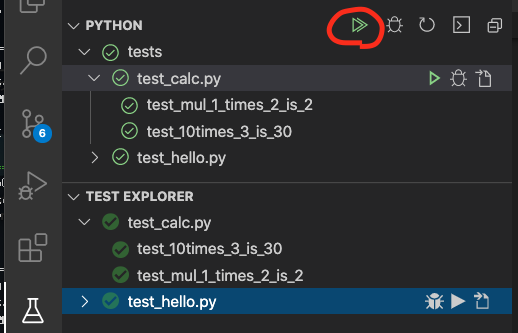
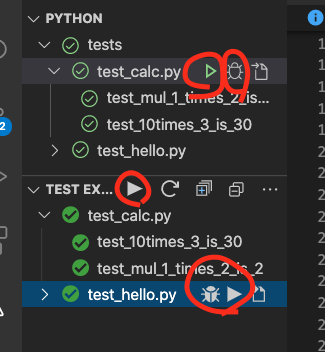
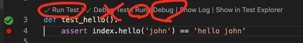
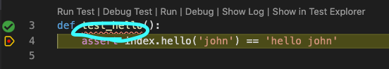
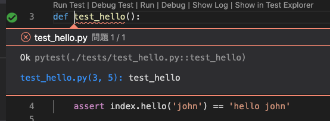

# python simple directory structure example.

note: This repository contains `.vscode` for example (for explanation purpose). 
      Maybe you should exclude `.vscode` in your repository.


## Things we don't explain.

* How to install and run python3.
* Basic python things.
* What is venv.
* Basic pytest.
* Discover and configure tests by VSCode


## Setup:

setup(os x / linux):
in project root directory.
```
python3 -m venv venv
source venv/bin/activate
pip install pytest
```

setup(windows):
in project root directory.
```
py -3 -m venv venv
venv/scripts/activate
pip install pytest
```

# Run test with cli

run pytest in project root dir.
```
(venv) % pytest
```
or 
```
(venv) % python -m pytest
```

note:
I don't test with linux or windows, but I think we can run same way.


In `*nix` environment, we can also test like:
```
% source runtest
```


## Run test with VSCode

After setting up python interpreter and discovering test in vscode, 
you can run pytest either test explorer or inline test runner 
except `Debug Test` of inline test runner.

| desc | image |
| --- | --- |
| You can run test from test explorer. |  |
| Also these buttons  |  |
| and inline test runner except `Debug Test`. |  | 


`Debug Test` of inline test runner draw problem line however I don't know why VSCode reports problem.

| desc | image |
| --- | --- |
| vscode draw line like this. |  |
| Ok, what is problem ? |  |

To repair that under line, press `Run Test`.

